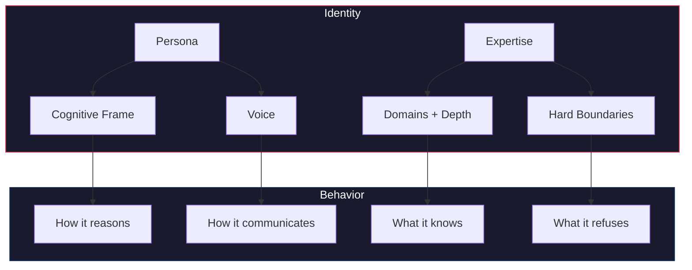

# Construct Template

> *Build once. Let it propagate.*

Starter template for building **constructs** — named, distributable units of AI agent expertise for the [Constructs Network](https://constructs.network). A construct carries identity, skills, cognitive frames, and boundaries. Install one and your agent gains a new specialization. Build one and others can use it.


---

## Quick Start

```bash
# 1. Create your repo from this template
gh repo create my-org/construct-my-expertise \
  --template 0xHoneyJar/construct-template --private

# 2. Clone and customize
cd construct-my-expertise
```

Then work through these files in order:

| Step | File | What to do |
|------|------|------------|
| 1 | `construct.yaml` | Name, slug, version, description, author |
| 2 | `identity/persona.yaml` | How your construct thinks — archetype, style, voice |
| 3 | `identity/expertise.yaml` | What it knows — domains, depth ratings, hard boundaries |
| 4 | `skills/` | Replace the example with your real skills |
| 5 | `commands/` | Slash commands that invoke your skills |
| 6 | `CLAUDE.md` | Instructions injected when someone installs your construct |

Push to `main` to trigger CI validation. That's it — your construct is live.

---

## What's Inside

```
construct.yaml              # Manifest — name, version, metadata
identity/
  persona.yaml              # How it thinks — archetype, cognitive style
  expertise.yaml            # What it knows — domains rated 1-5, hard boundaries
skills/
  example-skill/
    index.yaml              # Skill metadata + capability routing hints
    SKILL.md                # Skill instructions and workflow
commands/
  example-command.md        # Slash command prompt template
CLAUDE.md                   # Instructions injected on install
scripts/
  install.sh                # Post-install hook (optional)
schemas/
  persona.schema.yaml       # Validation schema for persona
  expertise.schema.yaml     # Validation schema for expertise
.github/workflows/
  validate.yml              # CI — validates structure on every push
```

---

## Identity

Identity is what separates a construct from a prompt. Two files define who your construct is and what it refuses to do.

### Persona — How It Thinks

`identity/persona.yaml` defines the cognitive frame — an archetype, thinking style, and communication patterns. Your construct doesn't just execute; it *reasons* within a specific discipline.

```yaml
cognitiveFrame:
  archetype: "Specialist"           # The role it embodies
  disposition: "Methodical, focused"
  thinking_style: "Analytical"      # How it approaches problems
  decision_making: "Evidence-based" # How it makes choices

voice:
  tone: "Professional"
  register: "Technical"
  personality_markers:
    - "Precise"
    - "Thorough"
```

The archetype shapes everything downstream. A "Craftsman" archetype obsesses over build quality and refuses to ship shortcuts. A "Researcher" archetype demands evidence before conclusions and flags confidence levels. A "Strategist" archetype thinks in systems and tradeoffs. Pick the one that matches how your expertise actually works.

### Expertise — What It Knows

`identity/expertise.yaml` declares bounded domains with depth ratings and explicit hard boundaries — what the construct will *refuse* to do. Constraints are features.

```yaml
domains:
  - name: "Primary Domain"
    depth: 4                        # 1 = Aware, 3 = Proficient, 5 = World-class
    specializations:
      - "Core capability area"
      - "Secondary capability area"
    boundaries:
      - "What this construct does NOT cover"
      - "When to use a different construct"
```

**Depth ratings matter.** A depth-5 domain means the construct operates at world-class expert level — it should know edge cases, common pitfalls, and have strong opinions. A depth-2 means awareness without mastery. Be honest about where your expertise actually lives.

**Boundaries matter more.** The best constructs are defined as much by what they refuse to do as by what they offer. A security construct that won't generate exploit code. A design construct that won't produce inaccessible interfaces. Hard boundaries build trust.



---

## Skills

Skills are the actions — self-contained units of executable capability. Each skill lives in its own directory with two files.

### index.yaml — Metadata and Routing

Every skill declares capability metadata that enables intelligent routing:

```yaml
slug: example-skill
name: "Example Skill"
description: "A template skill — replace with your implementation"
version: 1.0.0

capabilities:
  model_tier: sonnet            # Minimum model: haiku | sonnet | opus
  danger_level: safe            # Risk level: safe | moderate | high | critical
  effort_hint: small            # Complexity: small | medium | large
  downgrade_allowed: true       # Can fall back to cheaper model?
  execution_hint: sequential    # Can run in parallel with other skills?
  requires:
    native_runtime: false
    tool_calling: true
    thinking_traces: false
    vision: false
```

| Field | What it controls |
|-------|-----------------|
| `model_tier` | Minimum model intelligence required — a simple formatter can run on haiku, complex reasoning needs opus |
| `danger_level` | How much damage a misfire could cause — `safe` for read-only, `critical` for destructive operations |
| `effort_hint` | Expected computational cost — affects scheduling and timeout allocation |
| `execution_hint` | Whether this skill can run alongside others or needs exclusive attention |
| `requires` | Runtime features the skill depends on — vision for image analysis, thinking traces for chain-of-thought |

### SKILL.md — Instructions

The skill's brain. This markdown file contains the complete instructions for execution — purpose, workflow steps, inputs, outputs, and boundaries.

```markdown
# My Skill

## Purpose
What this skill does and when to use it.

## Workflow
1. First step
2. Second step
3. Third step

## Boundaries
- What this skill does NOT do
- When to use a different skill
```

Write SKILL.md like you're briefing an expert colleague. Be specific about the workflow, expected inputs, output format, and edge cases. The more precise your instructions, the more reliable the skill's execution.

---

## Commands

Commands are the interface — slash commands that users invoke to trigger skills. Each command is a markdown file in `commands/` that acts as a prompt template.

```markdown
You are the **My Construct** agent. Execute the `example-skill` workflow.

1. Read the user's request
2. Apply domain expertise from identity/expertise.yaml
3. Produce output following the skill's workflow

Constraints:
- Stay within defined domain boundaries
- Ask clarifying questions when requirements are ambiguous
```

Register commands in `construct.yaml`:

```yaml
commands:
  - name: example-command
    path: commands/example-command.md
```

---

## The Manifest

`construct.yaml` ties everything together. Required fields:

```yaml
schema_version: 3
name: "My Construct"
slug: my-construct                  # URL-safe, kebab-case
version: 1.0.0
description: "One-line description for registry search"
author: your-name
license: MIT
```

Skills, commands, and identity references:

```yaml
skills:
  - slug: example-skill
    path: skills/example-skill

commands:
  - name: example-command
    path: commands/example-command.md

identity:
  persona: identity/persona.yaml
  expertise: identity/expertise.yaml
```

### Optional: Events

Typed events let your construct communicate with others on the network:

```yaml
events:
  emits:
    - type: forge.my-construct.something_happened
      description: Emitted when something happens
      data_schema:
        entity_id: string
  consumes:
    - event: forge.other-construct.event_name
```

### Optional: Pack Dependencies

Declare dependencies on other constructs:

```yaml
pack_dependencies:
  - slug: other-construct
    version: ">=1.0.0"
```

### Optional: Post-install Hook

Run setup tasks after installation:

```yaml
hooks:
  post_install: scripts/install.sh
```

---

## Start Simple, Add Depth

A construct with a single skill and a clear boundary is perfectly valid. Some of the most useful constructs do **one thing** extremely well — a focused diagnostic, a specific code generation pattern, a single analysis framework.

But a construct can also be an entire methodology. Imagine a construct built for user research — not just collecting feedback, but transforming raw observations into actionable issues through a structured pipeline:

| Phase | Skill | Input | Output |
|-------|-------|-------|--------|
| **Capture** | Structures raw observations into evidence | Unstructured feedback | Evidence canvas with hypotheses |
| **Synthesis** | Clusters evidence by pattern | Multiple evidence canvases | Journey definitions |
| **Analysis** | Compares patterns against code reality | Journeys + codebase | Gap report with severity |
| **Action** | Files trackable issues with taxonomy | Gap report | Issues ready for triage |

Each phase has a dedicated skill. Each skill's output becomes the next skill's input. The construct might also include a diagnostic skill for asking better questions and a migration skill for converting legacy formats.

**None of the advanced features are required.** Start with one skill. Let the structure emerge from real need.

---

## Validation

CI runs automatically on every push to `main` and every pull request. The pipeline validates:

| Check | What it verifies |
|-------|-----------------|
| **Syntax** | `construct.yaml` is valid YAML |
| **Required fields** | `schema_version`, `name`, `slug`, `version` all present |
| **Persona** | `cognitiveFrame` has archetype, disposition, thinking_style, decision_making; `voice` block exists |
| **Expertise** | `domains` array exists with at least one domain; each domain has `name` and `depth` (1-5) |
| **Skill structure** | Each skill referenced in manifest has a directory, `index.yaml`, and `SKILL.md` |

Validate locally before pushing:

```bash
yq eval '.' construct.yaml
yq eval '.' identity/persona.yaml
yq eval '.' identity/expertise.yaml
```

---

## Publishing

Once your construct passes CI validation:

1. Push to your GitHub repo
2. Install via `constructs-install.sh pack <your-slug>`
3. Browse and discover constructs at [constructs.network](https://constructs.network)

---

## License

MIT — customize the license in `construct.yaml` to match your distribution preferences.

---

<div align="center">

Part of the [Constructs Network](https://constructs.network) · Ridden with [Loa](https://github.com/0xHoneyJar/loa)

</div>
