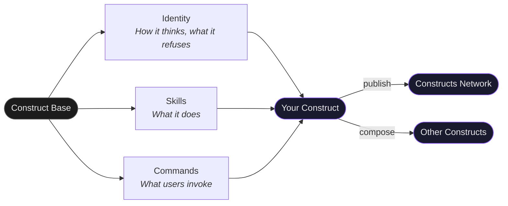

# Construct Base

Your starting build. Everything you need to create, validate, and ship a construct.

```bash
gh repo create my-org/construct-my-expertise \
  --template 0xHoneyJar/construct-template --private --clone
cd construct-my-expertise
```

The base ships with a working construct (Code Review Assistant) — not empty scaffolding. Read it, then make it yours.

---

## Quick Start

Edit three files. Push.

1. **`construct.yaml`** — name, slug, author
2. **`skills/example-simple/SKILL.md`** — your skill's instructions
3. **`CLAUDE.md`** — your construct's identity

```bash
git add -A && git commit -m "feat: my first construct" && git push
```

CI validates automatically. Placeholder text is blocked — you can't ship "your-name" or TODO markers.

---

## What's in the Build

```
construct.yaml              # Manifest — name, version, skills, commands
CLAUDE.md                   # Identity — injected when your construct is active
identity/
  persona.yaml              # How it thinks — archetype, cognitive style, voice
  expertise.yaml            # What it knows — domains rated 1-5, hard boundaries
skills/
  example-simple/           # Minimal skill (~30 lines) — direct, focused
  example-full/             # Complete skill (~130 lines) — multi-step workflow
commands/
  example-command.md        # Slash command prompt template
```


```mermaid
graph LR
    Base([Construct Base]) --> Identity["Identity<br/><i>How it thinks, what it refuses</i>"]
    Base --> Skills["Skills<br/><i>What it does</i>"]
    Base --> Commands["Commands<br/><i>What users invoke</i>"]
    Identity --> Construct([Your Construct])
    Skills --> Construct
    Commands --> Construct
    Construct --> |publish| Network([Constructs Network])
    Construct --> |compose| Other([Other Constructs])

    style Base fill:#1c1c1c,stroke:#555,color:#e8e8ea
    style Construct fill:#1a1a2e,stroke:#8B5CF6,color:#e8e8ea
    style Network fill:#1a1a2e,stroke:#8B5CF6,color:#e8e8ea
    style Other fill:#1a1a2e,stroke:#8B5CF6,color:#e8e8ea
```

---

## Two Example Skills

**`example-simple`** — The starter. Trigger, workflow, boundaries. If your skill is one focused action, start here.

**`example-full`** — The methodology. Multi-step workflow, quality gates, error handling. If your skill is a process, start here.

Both follow the same structure: what it is → how it works → the non-obvious insight → boundaries.

---

## Identity

**`persona.yaml`** — The cognitive frame. A Craftsman obsesses over build quality. A Researcher demands evidence. The archetype shapes every decision your construct makes.

**`expertise.yaml`** — Bounded domains with depth ratings (1-5). Be honest. Boundaries are features — what your construct refuses to do builds trust.

**`CLAUDE.md`** — Not documentation. Instructions injected into the AI runtime. Shapes how the agent *thinks*:
- What it sees (the perceptual lens)
- How it works (default behavior)
- What it refuses (hard boundaries)

---

## CI — Three Levels

| Level | When | What |
|-------|------|------|
| **L0** | Every push | YAML valid, no placeholders, skills exist |
| **L1** | PRs to main | Schema validation, capability metadata, required sections |
| **L2** | Releases | Publishing gate — everything a consumer needs |

Start at L0. Graduate when ready.

---

## Compose

Constructs aren't solo. Declare events and dependencies to build compositions:

```yaml
events:
  emits:
    - type: forge.my-construct.issue_found
  consumes:
    - event: forge.observer.feedback_captured

pack_dependencies:
  - slug: observer
    version: ">=1.0.0"
```

---

## Publish

Push to GitHub. Register at [constructs.network](https://constructs.network). Others install with one command.

---

## Links

- [constructs.network](https://constructs.network) — Marketplace
- [Loa](https://github.com/0xHoneyJar/loa) — Framework
- [Construct Base Docs](https://github.com/0xHoneyJar/construct-template) — This repo

MIT — customize the license in `construct.yaml` for your distribution.
